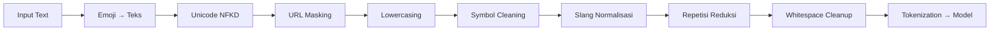

<p align="center">
  
  
  
  
  
  
  <br />
  
  
  
</p>

<h1 align="center">🎯 YouTube Judol Comment Remover</h1>

<p align="center">
  <em>Ekstensi browser berbasis NLP untuk mendeteksi, menyembunyikan, dan menyorot komentar judi online (judol) di YouTube</em>
  <br />
  <strong>— Proyek Final Mata Kuliah Natural Language Processing —</strong>
</p>

---

## 📋 Daftar Isi

- [Informasi Proyek](#-informasi-proyek)
- [Latar Belakang](#-latar-belakang)
- [Fitur](#-fitur)
- [Arsitektur Sistem](#-arsitektur-sistem)
- [Pipeline NLP](#-pipeline-nlp)
- [Model & Hasil Evaluasi](#-model--hasil-evaluasi)
- [Dataset](#-dataset)
- [Tech Stack](#-tech-stack)
- [Deployment](#-deployment)
- [Struktur Repository](#-struktur-repository)
- [Dokumentasi](#-dokumentasi)
- [Deliverables](#-deliverables)

---

## 👥 Informasi Proyek

<table>
<tr>
  <td><strong>Kelompok</strong></td>
  <td>Newton</td>
  <td><strong>Domain</strong></td>
  <td>Sosial Media (YouTube)</td>
</tr>
<tr>
  <td><strong>Program Studi</strong></td>
  <td>Teknik Informatika</td>
  <td><strong>Jenis Aplikasi</strong></td>
  <td>Text Classification + Browser Extension</td>
</tr>
<tr>
  <td><strong>Mata Kuliah</strong></td>
  <td>Natural Language Processing</td>
  <td><strong>Bahasa</strong></td>
  <td>Indonesia</td>
</tr>
<tr>
  <td><strong>Dosen Pengampu</strong></td>
  <td colspan="3">Muhammad Yazid Supriadi S.Kom, M.Kom</td>
</tr>
<tr>
  <td><strong>Asisten Dosen/Lab</strong></td>
  <td colspan="3">Romi Wahyudi</td>
</tr>
</table>

### Anggota Kelompok

| Nama | NIM |
|------|:---:|
| Muhammad Jibril Ibrahim | 0110224002 |
| Rohmatul Hidayat | 0110224015 |
| Achmad Muflih Alrasyid | 0110224162 |
| Muhammad Ridwan Karim | 0110224122 |
| Anwar Maulana | 0110224020 |

---

## 🧠 Latar Belakang

Komentar judi online (*judol*) di YouTube semakin marak — promosi situs judi, link referral, ajakan bermain dengan iming-iming keuntungan cepat. Konten ini mengganggu pengalaman menonton, berpotensi menyesatkan (terutama remaja), dan sulit diblokir manual karena terus berganti variasi teks.

**Masalah:**
- Pengguna kesulitan memfilter komentar judol secara manual
- Pola teks judol bervariasi (slang, typo, emoji, link tersembunyi, nama situs tersamar)
- Moderasi platform tidak selalu cukup cepat atau konsisten

**Solusi:** Ekstensi browser yang mendeteksi komentar judol secara otomatis menggunakan model NLP berbahasa Indonesia, lalu menyembunyikan atau menyorotnya.

---

## ✨ Fitur

### Model NLP
| Fitur | Detail |
|-------|--------|
| **Task** | Klasifikasi biner: `judol` vs `bukan_judol` |
| **Model** | BiGRU (PyTorch), LSTM (TensorFlow), **IndoBERT + Focal Loss** (HuggingFace) |
| **Preprocessing** | Emoji → teks, Unicode NFKD, URL masking, slang normalisasi (saka-nlp), reduksi repetisi |
| **Evaluasi** | Accuracy, precision, recall, F1-score, confusion matrix, ROC-AUC, error analysis |

### Ekstensi Browser (Chrome/Edge — Manifest V3)

| Fitur | Detail |
|-------|--------|
| **Hide** | Sembunyikan komentar yang terdeteksi judol |
| **Highlight** | Sorot komentar dengan border + label confidence |
| **Toggle Mode** | Pilih hide atau highlight |
| **Threshold** | Filter prediksi (0,50–0,95) |
| **Statistik Sesi** | Jumlah komentar terdeteksi per halaman |
| **Master Switch** | Enable/disable tanpa uninstall |
| **API Status** | Indikator ketersediaan API di popup |

---

## 🏗️ Arsitektur Sistem

```
┌─────────────┐     ┌──────────────────┐     ┌──────────────────────┐
│ YouTube DOM │────>│  Content Script   │────>│   Service Worker     │
│  comments   │     │  (youtube.js)     │     │  (background.js)     │
└─────────────┘     │  + preprocess.js  │     └──────────┬───────────┘
        ▲           └──────────────────┘                │ POST /predict
        │                                                ▼
        │                                         ┌──────────────┐
        └─────────────────────────────────────────│ HF Spaces API │
                Hide / Highlight action            │  (FastAPI)    │
                                                  └──────────────┘
```

**Alur Runtime:**
1. `youtube.js` memindai komentar via `MutationObserver` pada `ytd-comment-thread-renderer`
2. Teks dipreprocess di klien (`preprocess.js`) — mirror pipeline Python
3. Komentar dikirim batch ke service worker → POST ke Hugging Face Space API
4. API menjalankan inferensi IndoBERT → `{label, score}`
5. Content script menerapkan **Hide** atau **Highlight** sesuai pengaturan

---

## 🔧 Pipeline NLP

Pipeline identik di Python (training) dan JavaScript (runtime ekstensi):



| Langkah | Contoh Input | Output |
|---------|-------------|--------|
| **Emoji** | 🥺 | `pleading_face` |
| **Unicode** | 𝘀𝗶𝘁𝘂𝘀 | `situs` |
| **URL** | `bit.ly/judi` | `[URL]` |
| **Slang** | `wd`, `depo` | `withdraw`, `deposit` |
| **Repetisi** | `bngettt` | `bngett` |

---

## 📊 Model & Hasil Evaluasi

Tiga model dilatih pada **70.379 komentar** berbahasa Indonesia. Detail lengkap di [Laporan Evaluasi Model](Docs/Laporan_Evaluasi_Model.md).

### Ringkasan Metrik

| Metrik | BiGRU | LSTM | 🏆 IndoBERT-focal |
|--------|:-----:|:----:|:-----------------:|
| **Accuracy** | 99,23% | 99% | **99,64%** |
| **Judol Precision** | 0,97 | 0,93 | **0,99** |
| **Judol Recall** | 0,96 | 0,97 | **0,98** |
| **Judol F1-Score** | 0,97 | 0,95 | **0,98** |
| **False Positive** | 49 | 119 | **23** |
| **False Negative** | 65 | 49 | **28** |
| **ROC-AUC** | — | 0,9953 | — |

### Perbandingan Arsitektur

| Aspek | BiGRU | LSTM | IndoBERT-focal |
|-------|:-----:|:----:|:--------------:|
| **Jenis** | RNN (GRU) | RNN (LSTM) | Transformer (BERT) |
| **Framework** | PyTorch | TensorFlow/Keras | HuggingFace Transformers |
| **Pre-trained** | ❌ (from scratch) | ❌ (from scratch) | ✅ indobert-base-p1 |
| **Tokenisasi** | Word-level (23K vocab) | Word-level (15K vocab) | Subword WordPiece (32K) |
| **Imbalance** | — | Class Weights | Focal Loss (α=7,61, γ=2,0) |
| **Epochs** | 5 | 6 (early stop) | 5 |

### Insight Utama

> 🥇 **IndoBERT-focal adalah model terbaik** — accuracy 99,64%, **hanya 23 FP & 28 FN** dari 14.076 sampel uji. Analisis error menunjukkan sebagian besar kesalahan adalah *noise label dataset*, bukan kelemahan model. Focal Loss dengan α=7,61 berhasil mengatasi ketidakseimbangan kelas (rasio ~7,6:1).

> ⚡ **BiGRU alternatif ringan** — accuracy 99,23%, hanya 49 FP. Ukuran model jauh lebih kecil, cocok untuk inferensi *real-time* di lingkungan dengan resource terbatas (side-loading di extension).

> 📈 **LSTM recall tertinggi** (0,97) dengan ROC-AUC 0,9953 — menunjukkan diskriminasi kelas yang sangat baik.

---

## 📁 Dataset

| Metrik | Nilai |
|--------|-------|
| **Total baris** | 70.379 |
| **Label 0 (Bukan Judol)** | 62.202 (88,4%) |
| **Label 1 (Judol)** | 8.177 (11,6%) |
| **Sumber** | 6 dataset Kaggle → [Sumber](Dataset/Notes/Sumber.txt) |

**Ciri khas komentar judol:** nama situs tersamar (`alexis17`, `pulauwin`, `sgi88`), kata promosi (`depo`, `wd`, `gacor`, `maxwin`, `cuan`), emoji tertentu (`❤️`, `🔥`, `⭐`).

---

## 🛠️ Tech Stack

| Lapisan | Teknologi |
|---------|-----------|
| **Training** |  3.10+, , ,  |
| **Data & Evaluasi** | , scikit-learn, matplotlib, seaborn, saka-nlp |
| **Deploy API** | , , Hugging Face Spaces |
| **Ekstensi** | Chrome Extension Manifest V3 (JavaScript), DOM MutationObserver |
| **Preprocessing JS** | Custom pipeline (emoji map, Unicode NFKD, slang dictionary) |

---

## 🚀 Deployment

### Hugging Face Spaces

| Komponen | Detail |
|----------|--------|
| **Endpoint** | `POST /predict` |
| **Input** | `{"text": "komentar youtube"}` |
| **Output** | `{"label": "judol"|"bukan_judol", "score": 0.98}` |
| **Port** | 7860 |
| **Model** | IndoBERT + Focal Loss |

### Browser Extension — Panduan Instalasi

```bash
# 1. Clone repository
git clone https://github.com/jeebrielibr/NLP-Final-Project.git

# 2. Buka chrome://extensions (atau edge://extensions)
# 3. Aktifkan Developer Mode
# 4. Klik "Load unpacked" → pilih folder extension/
# 5. Buka video YouTube — ekstensi otomatis memindai komentar
# 6. Klik icon ekstensi untuk atur mode, threshold, statistik
```

---

## 📂 Struktur Repository

```
NLP Final Project/
├── Dataset/                    # Dataset mentah & terproses
│   ├── datasetraw1–6.csv       # 6 dataset Kaggle
│   ├── dataset_prepared.csv    # Merge ~70K baris
│   ├── dataset_clean_final.csv # Final siap training (70.379 baris)
│   └── Notes/
├── Notebook/                   # Jupyter notebooks
│   ├── DataPreparation.ipynb   # Merge & dedup
│   ├── EDA.ipynb               # Exploratory data analysis
│   ├── AdvancedPreprocessing   # Pipeline preprocessing
│   ├── FeatureExtraction.ipynb # Tokenisasi
│   ├── GRU_model.ipynb         # BiGRU (PyTorch)
│   ├── LSTM.ipynb              # BiLSTM (TensorFlow)
│   └── IndoBERT_focal.ipynb    # ✨ Best model
├── model/
│   ├── bigru/                  # BiGRU model
│   └── indobert_judol_model_focal/  # 🏆 IndoBERT + Focal Loss
├── deployhf/                   # Hugging Face Spaces
│   ├── app.py                  # FastAPI endpoint
│   ├── Dockerfile
│   └── requirements.txt
├── extension/                  # Chrome/Edge Extension
│   ├── manifest.json           # Manifest V3
│   ├── background/             # Service worker
│   ├── content/                # youtube.js + preprocess.js
│   ├── popup/                  # Settings UI
│   └── styles/                 # Hide/highlight CSS
├── Docs/                       # Dokumentasi
├── Laporan/                    # Laporan final (PDF)
├── .gitignore
└── README.md
```

---

## 📄 Dokumentasi

| Dokumen | Isi |
|---------|-----|
| [Rencana Proyek](Docs/Rencana_Proyek.md) | Arsitektur, pipeline, evaluasi, rencana implementasi |
| [Ketentuan Mata Kuliah](Docs/Desc.md) | Kelompok, syarat, bobot penilaian |
| [Laporan EDA](Docs/EDA_Report.md) | Distribusi label, panjang teks, kata kunci |
| [Strategi Preprocessing](Docs/Advanced_Preprocessing_Strategy.md) | Detail pipeline preprocessing |
| [Feature Extraction](Docs/Feature_Extraction_Pipeline.md) | Tokenisasi word-level & subword |
| [Evaluasi Model](Docs/Laporan_Evaluasi_Model.md) | Hasil BiGRU, LSTM, **IndoBERT-focal** |

---

## ✅ Deliverables

- [x] Repositori kode lengkap dengan pipeline preprocessing
- [x] 3 model NLP: BiGRU, LSTM, IndoBERT + Focal Loss
- [x] Evaluasi model: metrik, confusion matrix, error analysis
- [x] Hugging Face Spaces API (FastAPI + Docker)
- [x] Ekstensi Chrome/Edge (Hide + Highlight + Threshold)
- [ ] Laporan PDF final
- [ ] Slide presentasi

---

<p align="center">
  <sub>Proyek Akademik — Teknik Informatika · Natural Language Processing</sub>
  <br />
  <sub>© 2026 Kelompok Newton</sub>
</p>
